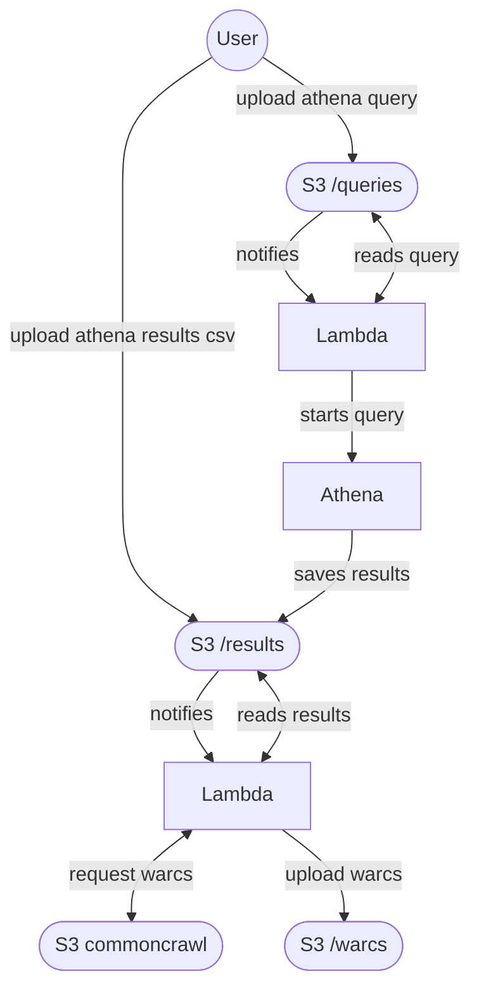

# download-from-common-crawl

This project uses Terraform to schedule Athena Queries
in AWS us-east-1 querying the [Common Crawl](https://commoncrawl.org/),
which contains petabytes of billions of webpages in 40+ languages.

This project was designed to run for free on us-east-1 where
the data is located.

# development

1. run `deploy.sh dev`
2. wait for the second file to be created in s3://your_bucket/results
3. upload a CSV file containing at least these 3 columns to s3://your_bucket/results

```
"warc_filename","warc_record_offset","warc_record_length"
"crawl-data/CC-MAIN-2021-10/segments/161.53/robotstxt/CC-MAIN-2021030106-2021030109-00602.warc.gz","1843978","19366"
```

this is the same format of output created by Athena queries if perform queries similar to
 
```
SELECT warc_filename, warc_record_offset, warc_record_length
FROM "ccindex"
WHERE url_host_registered_domain = 'wikipedia.org'
 AND url_path like '/wiki/%s'
 AND fetch_status = 200
LIMIT 1
```

Alternatively you can also upload such a query to s3://your_bucket/queries and it will be executed, triggering the creation of the results file, which will trigger the download of warc files


# supported flows


